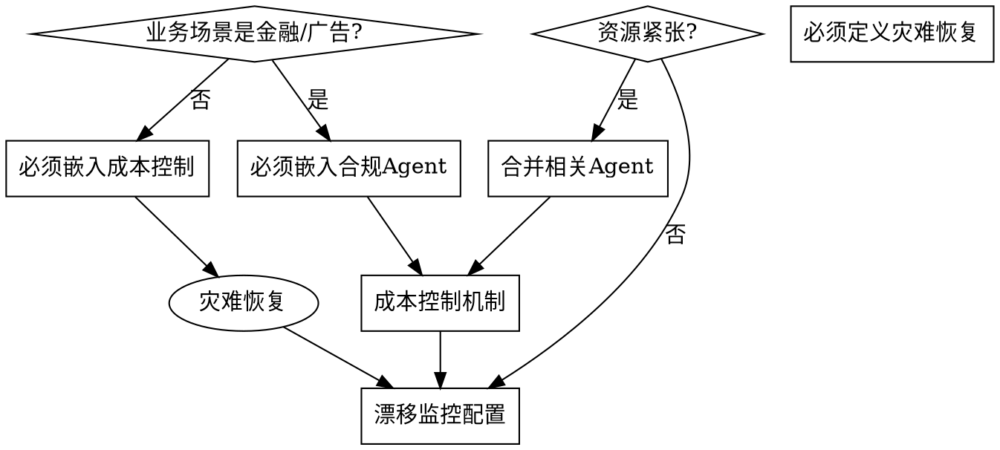

# Data Platform Agent Design

## Overview

Design multi-agent architectures that transform business requirements into executable data platforms. Core principle: agent systems are cognitive layers over distributed compute infrastructure—not replacements for it.

## When to Use

**Trigger when you hear:**
- "数据平台", "智能标签", "用户画像", "DMP", "风控建模"
- "数据分析需求", "AI Agent 架构", "多智能体"
- "程序化广告", "金融风控", "商业化数据服务"

**Symptoms this skill applies:**
- Vague business requirements that need structured decomposition
- Need to translate business pain points into agent responsibilities
- Designing new or evaluating existing agent orchestration systems
- Team asking "how do we build this with AI agents?"

**Do NOT use when:**
- Simple single-purpose automation (use direct tool calling instead)
- Already have approved architecture and need implementation help

## Core Pattern: 5-Dimensional Requirement Analysis

Before designing any agent architecture, decompose requirements across five dimensions:

```
┌─────────────────────────────────────────────────────┐
│            5-Dimensional Analysis                   │
├─────────────────────────────────────────────────────┤
│  1. 目标层 (Why)     → 数据资产化 / 业务增长 / 商业化 │
│  2. 场景层 (Where)   → 画像标签 / 广告DMP / 风控 / 洞察报告 │
│  3. 客户层 (Who)     → 互联网公司 / 金融机构 / 广告主   │
│  4. 痛点层 (Pain)     → 标签质量 / 需求脱节 / 滞后分析 / 商业化路径 │
│  5. 交付层 (Deliver) → 标签体系 / 预测模型 / 数据产品 / 分析报告 │
└─────────────────────────────────────────────────────┘
```

## Agent Architecture Pattern

Use `Orchestrator-Worker` layered architecture:

```
[业务交互层]  自然语言 / API / 看板 / 工单
       ↓
[中枢编排层]  Orchestrator (意图识别 → 任务拆解 → 路由分发 → 状态追踪)
       ↓
[专业智能体层]
  ├─ Requirement Translator  (业务需求 → 数据需求)
  ├─ Data Steward           (数据治理 / ETL / 质量监控)
  ├─ Tag & Profiling        (标签挖掘 / 验证 / 血缘管理)
  ├─ Model Factory          (特征工程 / AutoML / 模型评估)
  ├─ DMP & Ad Strategy      (人群圈选 / 归因 / 竞价模拟)
  ├─ Risk Control           (图风控 / 反欺诈 / 评分卡)
  └─ Insight & Report       (NL2SQL / 归因分析 / 报告生成)
       ↓
[工具与数据层]  Spark/Flink | Feature Store | MLflow | Neo4j | VectorDB
       ↓
[安全与合规层]  脱敏网关 | RBAC | 审计日志 | 漂移监控 | HITL审批
```

## Critical Design Decisions (Flowchart)



**Required for ALL production designs:**
- Cost control (LLM cache, resource quotas, async batch)
- Disaster recovery (fallback strategy, SLA degradation path)
- Drift monitoring (PSI/KS checks, auto-retrain triggers)
- Explicit HITL checkpoints (model publishing, budget adjustment, label release)

## Quick Reference

| Component | Purpose | Never Skip |
|-----------|---------|------------|
| **Orchestrator** | Task routing, state management | Yes |
| **Data Steward** | Quality monitoring, ETL | Yes |
| **HITL Gateway** | Human approval on critical actions | Yes (financial/ad) |
| **Cost Controller** | Token budget, quota, caching | Yes |
| **Drift Monitor** | Model performance tracking | Yes |
| **Fallback Strategy** | System degradation path | Yes |

## Common Mistakes

| Mistake | Why It Fails | Fix |
|---------|--------------|-----|
| Skipping data quality governance | Garbage in, garbage out. Agent outputs are only as good as input data | Embed Data Steward Agent from Day 1 |
| Ignoring cost control | LLM token costs spiral under load or infinite loops | Add quotas, caching, small-model fallback |
| No disaster recovery plan | Single agent failure cascades to entire system | Define explicit fallback per critical path |
| Deferring drift monitoring | Models degrade silently, business decisions become unreliable | PSI/KS alerts + auto-retrain triggers |
| "Team is small, skip X" | Small teams get hit harder by failures | Simplify by merging agents, not by removing safeguards |
| Assuming clean requirements | Business users provide vague pain points | Use 5-dimension analysis to decompose before architecture |

## Rationalization Countermeasures

**If you hear yourself thinking:**
- "We'll add cost control later" → **Delete that thought**. Cost spirals from minute one.
- "Small team, skip disaster recovery" → **Wrong**. Small teams have less capacity to firefight.
- "Old system handles that" → **Check**. Old system is likely the source of current pain points.
- "This is specific to our case" → **Maybe, but** the 5-dimension pattern applies broadly.
- "Agent is autonomous, no need for HITL" → **Dangerous**. Financial and ad scenarios require audit trails.

**Countermeasure:** Force every design to answer these questions:
1. What happens when ANY single agent fails?
2. What is the cost per 1000 requests?
3. How do we know when the model is degraded?
4. Who approves model publishing?

## Red Flags - STOP

- No explicit cost control mechanism
- No disaster recovery or fallback strategy
- No drift monitoring defined
- No HITL checkpoint for sensitive actions (finance, ads, user data)
- No data quality governance layer
- "We'll add it later" mentality

**All of these mean: Your architecture is incomplete for production.**

## Real-World Pattern Summary

| Business Type | Architecture Emphasis | Key Agent | HITL Required |
|---------------|----------------------|-----------|---------------|
| **E-commerce Recommendation** | Scale, freshness | User Profile + Ranking | Partial (A/B only) |
| **Financial Risk Control** | Audit, explainability | Risk + Compliance | Yes (all decisions) |
| **Ad DMP** | Latency, targeting | DMP + Targeting | Yes (budget changes) |
| **Data Insight/BI** | Accuracy, narrative | Insight + NL2SQL | No (advisory only) |
